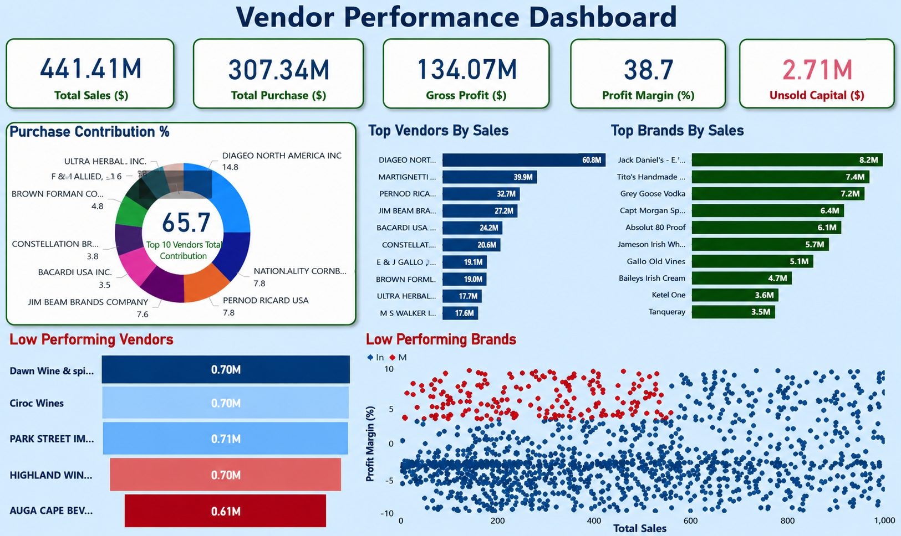
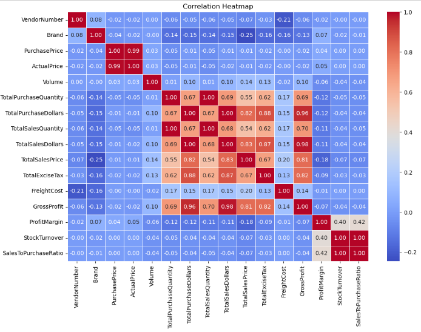
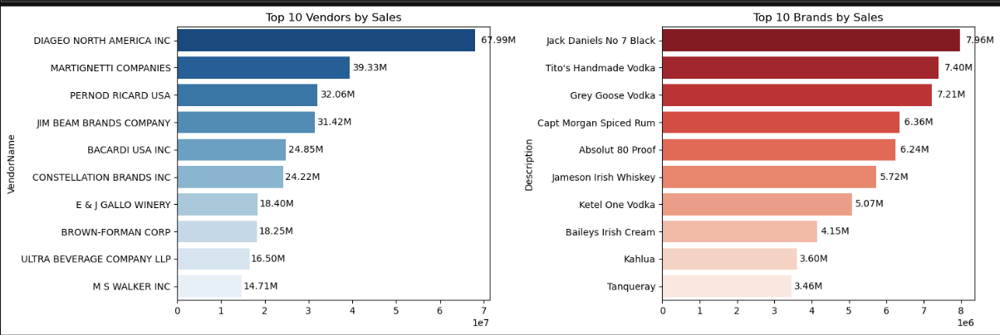
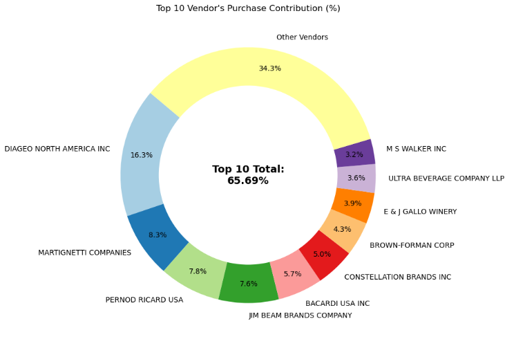
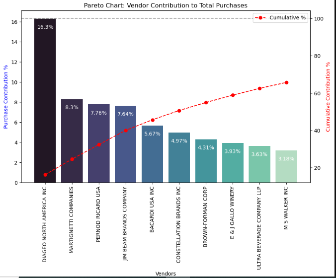
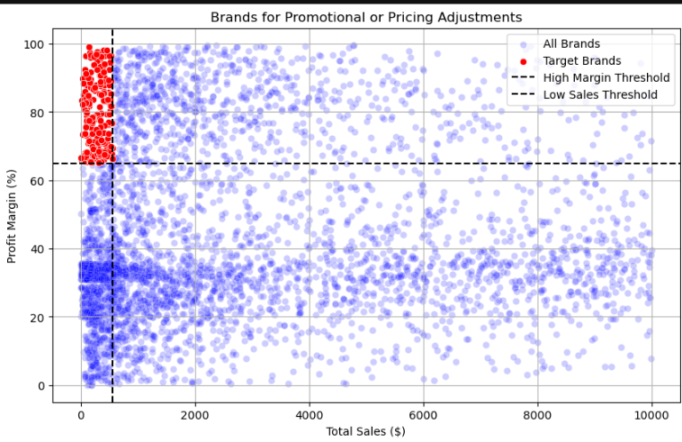
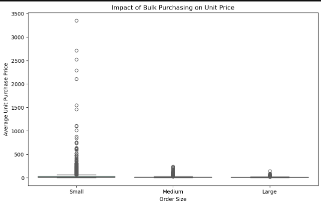
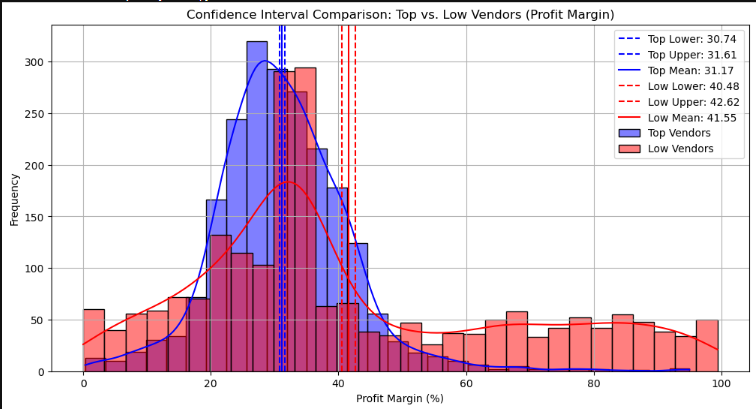

# 📊  Vendor Performance Intelligence: Optimizing Sales, Profitability & Inventory Efficiency


# 🚀 End-to-End Procurement Analytics & Business Intelligence Solution



---

# 🚀 Executive Summary

Modern organizations generate enormous volumes of purchasing, inventory, sales, and vendor transaction data. However, converting this information into actionable business intelligence remains a significant challenge.

This project simulates a real-world supply chain and procurement analytics engagement where approximately **1.86 GB of raw operational data** was transformed into a centralized analytical framework for evaluating vendor performance, inventory efficiency, procurement effectiveness, and profitability.

Using a combination of **Python, SQL, Statistical Analysis, and Power BI**, this solution uncovers:

✅ High-value vendors driving business growth
✅ Procurement concentration risks
✅ Inventory turnover inefficiencies
✅ Brand-level optimization opportunities
✅ Profitability improvement areas
✅ Unsold capital exposure

The final deliverable is an executive-level Power BI dashboard designed for procurement managers, supply chain analysts, category managers, and business stakeholders.

---

# 🎯 Business Problem

Organizations frequently face critical operational questions:

- Which vendors contribute most to revenue and profitability?
- Which suppliers create inventory inefficiencies?
- Are purchases concentrated among a small group of vendors?
- Which brands require promotional or pricing intervention?
- Does bulk purchasing improve procurement economics?
- How much working capital is locked in inventory?

Without a data-driven approach, answering these questions becomes difficult and often leads to inefficient procurement decisions, excess inventory costs, and reduced profitability.

This project addresses these challenges through advanced analytics and business intelligence.

---

# 🌍 Why This Project Matters

Vendor performance directly influences:

📈 Revenue Growth

📦 Inventory Efficiency

💰 Profitability

🏭 Supply Chain Stability

🎯 Procurement Effectiveness

⚠ Operational Risk Management

Organizations often lose significant working capital due to:

- Poor inventory turnover
- Vendor dependency risks
- Overstocked inventory
- Inefficient purchasing decisions
- Underperforming product portfolios

This project demonstrates how analytics can transform operational data into strategic business intelligence.

---

# 📑 Table of Contents

- [Enterprise Dataset Overview](#-enterprise-dataset-overview)
- [Business Objectives](#-business-objectives)
- [Data Engineering Workflow](#-data-engineering-workflow)
- [Technology Stack](#-technology-stack)
- [Power BI Dashboard](#-power-bi-dashboard)
- [Exploratory Data Analysis](#-exploratory-data-analysis)
- [Statistical Analysis](#-statistical-analysis)
- [Business Insights](#-business-insights)
- [Business Impact](#-business-impact)
- [Project Architecture](#-project-architecture)
- [Repository Structure](#-repository-structure)
- [How To Run](#-how-to-run)
- [Future Enhancements](#-future-enhancements)
- [Author](#-author)

---

# 📦 Enterprise Dataset Overview

The project integrates multiple operational datasets representing the complete vendor-to-sales lifecycle.

| Dataset | Business Function |
|----------|------------------|
| Begin Inventory | Opening inventory positions |
| End Inventory | Closing inventory balances |
| Purchase Prices | Procurement pricing records |
| Vendor Invoice | Supplier transaction history |
| Vendor Sales Summary | Consolidated analytical dataset |

---

## 📊 Data Environment

The project was developed using a comprehensive supply chain data ecosystem consisting of approximately **1.86 GB** of inventory, purchasing, sales, pricing, and vendor transaction records.

Due to GitHub storage limitations and repository optimization best practices, a curated subset of business-critical datasets (**~38.5 MB**) has been included in this repository for reference and reproducibility.

All analytical workflows, KPI calculations, statistical testing, vendor performance evaluations, inventory optimization analyses, and Power BI dashboards were developed using the complete underlying dataset.

| Metric | Value |
|---------|---------|
| Original Data Ecosystem | ~1.86 GB |
| Business Domains Covered | Inventory, Sales, Purchasing, Pricing & Vendor Operations |
| Analytical Processing | Full Dataset Utilized |
| GitHub Dataset Included | ~38.5 MB |
| Dashboard Development | Full Dataset |
| Statistical Analysis | Full Dataset |

### GitHub Dataset Contents

The following business-critical datasets are included in this repository:

- `begin_inventory.csv`
- `end_inventory.csv`
- `purchase_prices.csv`
- `vendor_invoice.csv`
- `vendor_sales_summary.csv`

These files provide sufficient context to understand the data model, business processes, analytical workflow, and dashboard development approach used throughout the project.

---

# 🎯 Business Objectives

### Vendor Intelligence

- Identify top-performing vendors
- Detect underperforming vendors
- Evaluate procurement concentration

### Inventory Optimization

- Measure stock turnover efficiency
- Identify inventory holding risks
- Analyze unsold capital

### Profitability Analysis

- Evaluate gross profit performance
- Compare vendor profit margins
- Assess pricing effectiveness

### Brand Performance

- Detect brands requiring intervention
- Support promotional planning
- Optimize pricing strategy

---

# 🏗 Data Engineering Workflow

The original data environment consisted of approximately **1.86 GB of fragmented operational datasets**.

To create a business-ready analytical framework:

### Data Pipeline

Raw Data Sources

⬇

Data Ingestion

⬇

Data Cleaning

⬇

Feature Engineering

⬇

Vendor Summary Generation

⬇

Exploratory Data Analysis

⬇

Statistical Analysis

⬇

Business Intelligence Dashboard

---

### Key Engineering Tasks

✔ Automated data ingestion

✔ Multi-source data integration

✔ Vendor performance aggregation

✔ Inventory transformation

✔ KPI generation

✔ Business metric calculation

✔ Dashboard-ready dataset creation

---

# 🛠 Technology Stack

| Category | Tools |
|-----------|--------|
| Programming | Python |
| Database | SQL |
| Data Analysis | Pandas, NumPy |
| Visualization | Matplotlib, Seaborn |
| Statistics | SciPy |
| Dashboarding | Power BI |
| Development Environment | Jupyter Notebook, VS Code |

---

# 📊 Power BI Dashboard

## Executive Vendor Intelligence Dashboard


### Executive KPIs

| KPI |
|------|
| Total Sales |
| Total Purchases |
| Gross Profit |
| Profit Margin |
| Unsold Capital |
| Top Vendors |
| Top Brands |
| Low Performing Vendors |
| Low Performing Brands |

---

# 📈 Exploratory Data Analysis

## Correlation Analysis



Understanding relationships between procurement, sales, profitability, and inventory metrics.

---

## Vendor & Brand Sales Performance



Identifies the highest-performing vendors and brands driving revenue generation.

---

## Purchase Contribution Analysis



Evaluates procurement concentration and supplier dependency.

---

## Vendor Pareto Analysis



Applies the 80/20 principle to identify vendors responsible for the majority of purchasing activity.

---

## Brand Optimization Analysis



Highlights brands with strong margins but lower sales volumes that may benefit from targeted promotional strategies.

---

## Bulk Purchase Analysis



Examines whether purchasing volume impacts procurement pricing.

---

# 📉 Statistical Analysis

## Confidence Interval Comparison



Compares profitability distributions across vendor groups and validates performance differences using statistical techniques.

---

# 💡 Business Insights

### Vendor Concentration Risk

A relatively small group of vendors contributes a significant share of procurement activity, indicating potential dependency risks.

### Inventory Optimization Opportunity

Several vendors exhibit lower inventory turnover, creating opportunities to reduce holding costs and improve working capital efficiency.

### Profitability Variation

Vendor-level profitability differs substantially, highlighting opportunities for supplier rationalization and pricing optimization.

### Brand Performance Opportunity

Certain brands maintain strong margins despite lower sales volumes, making them ideal candidates for marketing and promotional investment.

### Procurement Efficiency

Bulk purchasing generally contributes to lower acquisition costs and improved gross profitability.

---

# 💼 Business Impact

The analytical framework supports:

📈 Procurement Optimization

📦 Inventory Management

💰 Working Capital Reduction

🎯 Strategic Sourcing

📊 Vendor Performance Monitoring

⚠ Risk Identification

🚀 Data-Driven Decision Making

---

# 🗂 Repository Structure

```text
vendor-performance-inventory-analytics
│
├── data
├── notebooks
├── scripts
├── powerbi
├── reports
├── visuals
├── README.md
├── requirements.txt
└── .gitignore
```

---

# ▶️ How To Run

```bash
git clone https://github.com/itsdanishansari/vendor-performance-inventory-analytics.git
```

```bash
pip install -r requirements.txt
```

```bash
jupyter notebook
```

Run:

- exploratory_data_analysis.ipynb
- vendor_performance_analysis.ipynb

---

## 🔮 Future Enhancements

- 🤖 AI-Powered Vendor Risk Scoring System
- 📈 Demand Forecasting Using Machine Learning Models
- 📦 Predictive Inventory Optimization Framework
- 🧠 Vendor Segmentation Using Clustering Algorithms

---

# 👨‍💻 Author

### Danish Ansari

📧 danish.ansari76@gmail.com

🔗 GitHub: https://github.com/itsdanishansari

🔗 LinkedIn: https://www.linkedin.com/in/itsdanishansari

---

## ⭐ If you found this project insightful, consider giving it a star and connecting with me on LinkedIn.
